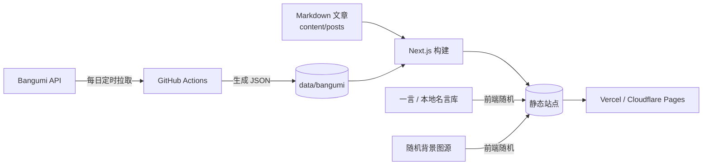
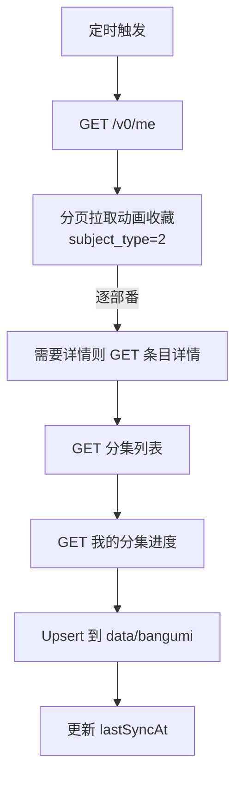

# 风起之地（凌风的个人站）· 设计方案

> 版本：v0.2（设计稿）  
> 定位：风起之地——一切的起始点。凌风的个人站：一个「看起来就是正常博客站」的个人站点，附带 Bangumi 追番数据自动同步、分集感想、随机二次元背景图与名言。

---

## 1. 项目概述

站点名称：**风起之地**（副标题：一切的起始点，仍是凌风的个人站）  
一句话描述：一个以看番记录为主线的个人博客。

三个核心诉求：

1. **自动同步**：Bangumi 收藏/追番/分集进度自动拉取并展示，不用手动维护「我在看什么」。
2. **分集感想**：博客可以给每一集写感想，页面明确标注集数，并按番剧聚合。
3. **氛围感**：随机美图背景 + 随机二次元名言，UI 好看但不花哨，整体像一个正经博客。

用户信息（已通过 API 实测验证）：

| 项目 | 值 |
|---|---|
| Bangumi UID | 966130 |
| 昵称 | 凌风 |
| 用户名（slug） | `966130`（未设置自定义 slug，与 UID 相同） |
| 授权方式 | 个人 Access Token（`next.bgm.tv` 生成，当前已验证可用） |

> 安全说明：Token 只存放在服务器环境变量 / GitHub Secrets 中，不写入代码、数据文件或提交历史。该 Token 属于个人访问令牌，存在有效期，后续需要人工轮换或升级为 OAuth 自动刷新。

---

## 2. 功能清单

### P0 · 上线必须有

- [ ] 首页：最新文章流 + 最近在追番 + 名言卡 + 随机背景
- [ ] 追番页：在看 / 看过 / 想看 分组展示，封面 + 进度条
- [ ] 番剧详情页：简介、评分、标签、分集列表，每集标注观看状态
- [ ] 博客：文章列表、详情页、标签、归档
- [ ] 分集感想：文章可关联 `番剧 + 集数`，自动显示 EP 徽章和封面
- [ ] 随机背景图：页面级背景，带降级（图片加载失败回退渐变）
- [ ] 随机名言：首页 / 页脚 / 404 页展示
- [ ] Bangumi 自动同步：定时任务，无需手动干预
- [ ] 响应式：手机 / 平板 / 桌面
- [ ] SEO 基础：标题、描述、Open Graph、sitemap
- [ ] RSS 订阅

### P1 · 体验加分

- 剧透折叠：EP 感想默认折叠剧透，点击展开
- 每集感想支持「一句话短评」和「长文感想」两种模式
- 追番进度徽章：`EP 5 / 12`
- 文章阅读时间 / 字数统计
- 上一篇 / 下一篇导航
- 404 页随机名言
- 深色 / 浅色主题切换（默认深色）
- 统计页：周/月/年观看汇总 + 趋势图 + 成就墙

### P2 · 以后再说

- 在线写作后台（初始阶段直接用 Markdown 文件写）
- Bangumi 反向同步（在站内标记观看进度回写到 Bangumi）
- 图片懒加载占位与平均色

---

## 3. 技术方案

### 3.1 推荐方案：静态优先（方案 A）

**Next.js（App Router）+ TypeScript + Tailwind CSS + Markdown/MDX + 定时同步脚本**

- 文章是 `content/posts/*.md`，带 frontmatter，天然适合 Git 管理
- Bangumi 数据由 GitHub Actions 定时同步成 `data/bangumi/*.json`，站点构建时读取
- 部署到 Vercel / Cloudflare Pages，全静态，零维护成本、加载快
- 写文章的方式：本地编辑器、GitHub 网页编辑，或手机端 Git 客户端

优点：免费、稳定、安全、符合「正常博客站」的形态。  
缺点：文章不是在线实时发布的，需要走 Git 提交。

### 3.2 备选方案：全动态站（方案 B）

**Next.js + 数据库（SQLite / Turso）+ 管理后台**

- 在线写文章、在线管理番剧
- 需要维护后台、鉴权、数据库备份

适合「想随时用手机记一笔」的需求。建议作为 v2 升级路径，架构上预留好接口，起步不用。

### 3.3 技术选型明细（按方案 A）

| 模块 | 选型 | 说明 |
|---|---|---|
| 框架 | Next.js（App Router）+ TypeScript | 生态成熟，SSG/ISR 都方便 |
| 样式 | Tailwind CSS + shadcn/ui | 组件美观、易定制 |
| 内容 | Markdown + gray-matter + MDX | frontmatter 存元数据（番剧 id、集数） |
| 数据 | `data/bangumi/*.json` | 同步脚本产物，随构建读取 |
| 同步 | GitHub Actions cron | 每日 1~2 次，可手动触发 |
| 部署 | Vercel / Cloudflare Pages | 免费层足够 |
| 图片 | `next/image` + 远端域名白名单 | 封面、背景图统一走图片优化 |
| 名言 | hitokoto 一言 API + 本地名言库兜底 | 离线不空 |

### 3.4 架构图



### 3.5 目录结构（草案）

```text
lingfeng-site/
├─ app/
│  ├─ page.tsx                 # 首页
│  ├─ blog/                    # 文章列表
│  ├─ blog/[slug]/             # 文章详情（EP 感想也在这里渲染）
│  ├─ bangumi/                 # 追番页
│  ├─ bangumi/[id]/            # 番剧详情 + 分集
│  ├─ tags/  archives/  about/
│  ├─ sitemap.ts  rss/route.ts
│  └─ layout.tsx
├─ content/posts/              # Markdown 文章（含每集感想）
├─ data/
│  ├─ bangumi/
│  │  ├─ user.json             # 用户信息 + 最后同步时间
│  │  └─ subjects/{id}.json    # 每部番 + 分集进度
│  └─ quotes.json              # 本地名言库（兜底）
├─ lib/
│  ├─ bgm.ts                   # Bangumi API 客户端
│  ├─ posts.ts                 # Markdown 读取/解析
│  └─ wallpaper.ts             # 背景图随机与降级
├─ public/wallpapers/          # 自建背景图池
├─ scripts/sync-bangumi.ts     # 同步脚本
├─ .env.example
└─ .github/workflows/sync.yml
```

---

## 4. Bangumi 数据同步设计

### 4.1 用到的接口（已核对官方 OpenAPI 并实测）

| 用途 | 接口 | 关键点 |
|---|---|---|
| 当前用户 | `GET /v0/me` | 已验证：昵称「凌风」，id 966130 |
| 动画收藏列表 | `GET /v0/users/966130/collections?subject_type=2&limit=100&offset=N` | 返回 `ep_status`、`rate`、`type`、`tags`、`subject` 摘要 |
| 单条目详情 | `GET /v0/subjects/{subject_id}` | 简介、评分、封面、总集数 |
| 分集列表 | `GET /v0/episodes?subject_id={id}&type=0&limit=200` | `ep`（集数）、`sort`、`name_cn`、`airdate` |
| 我的分集进度 | `GET /v0/users/-/collections/{subject_id}/episodes?limit=1000` | 每集状态：`0` 未收藏 / `1` 想看 / `2` 看过 / `3` 抛弃 |

收藏类型枚举：`1` 想看 / `2` 看过 / `3` 在看 / `4` 搁置 / `5` 抛弃。  
条目类型：`2` = 动画（本站只同步动画）。

### 4.2 同步流程



同步策略：

1. **全量收藏 + 增量分集**：收藏列表每页 100 条分页拉完；每部番剧的分集和观看进度全量刷新（数据量小，单部番最多几十集）。
2. **只保留动画**：`subject_type=2`，过滤 SP/OP/ED 之外的章节类型可按需。
3. **幂等写入**：以 `subject_id` / `episode_id` 为主键 Upsert，重复执行不产生脏数据。
4. **失败重试**：单部番失败不中断整体，记录错误；下次同步自动补齐。
5. **限流与礼貌**：
   - `User-Agent` 携带站点标识，如 `LingFengSite/0.1 (personal site)`
   - 请求间隔保守设为 1 次/秒；遇到 `429` / `403` 指数退避并停止本轮
   - 每次同步请求量 ≈ 收藏数 × 2~3，个人站规模完全可控

### 4.3 数据文件形态

```json
{
  "lastSyncAt": "2026-08-11T12:00:00+08:00",
  "user": { "id": 966130, "username": "966130", "nickname": "凌风" },
  "subjects": [
    {
      "id": 123,
      "name": "例のアニメ",
      "nameCn": "示例番剧",
      "collectionType": 3,
      "epStatus": 5,
      "totalEpisodes": 12,
      "rate": 0,
      "tags": ["原创", "奇幻"],
      "cover": "https://lain.bgm.tv/pic/cover/l/...",
      "summary": "……",
      "airDate": "2026-04-01",
      "rating": { "score": 8.1, "rank": 42 },
      "episodes": [
        {
          "id": 456,
          "ep": 1,
          "type": 0,
          "name": "はじまり",
          "nameCn": "开始",
          "airdate": "2026-04-01",
          "watchStatus": 2
        }
      ]
    }
  ]
}
```

如果某部番数据量变大，可以按 `data/bangumi/subjects/{id}.json` 拆文件，索引文件只放列表。构建时按需读取，避免全量加载。

---

## 5. 博客与分集感想设计

### 5.1 文章模型

每篇文章是一个 Markdown 文件，frontmatter 里带元数据：

```md
---
title: EP05 · 雨中告白
subject_id: 123          # 关联 Bangumi 番剧（可选）
anime: 示例番剧           # 冗余名称，用于不查 API 也能显示
ep: 5                    # 集数（可选，配合 subject_id）
date: 2026-08-11
tags: [感想, 恋爱]
spoiler: true            # 触发剧透折叠
summary: 这一集……（一句话）
---

正文内容……
```

规则：

- 带 `subject_id + ep` 的文章自动渲染为「EP 感想卡」：显示封面、番剧名、`EP 05` 徽章、观看状态。
- 不带 `subject_id` 的就是普通博客文章（随笔、年度总结等）。
- `spoiler: true` 时正文默认折叠，顶部显示「包含剧透，点击展开」。

### 5.2 两种感想粒度

1. **一句话短评**：写在文章 frontmatter 的 `summary`，在番剧分集列表里直接展示，适合懒得长写的时候。
2. **长文感想**：正文随便写，链接到对应分集。

这样番剧详情页的分集列表可以做到：

```text
EP 05 · 雨中告白      [已看] [一句话短评] [长文感想 →]
EP 06 · 转折点        [已看] [未写]
EP 07 · 决裂          [未看] [-]
```

### 5.3 关联与跳转

- 番剧详情页 → 每集下方显示「这篇有感想」，带链接
- EP 感想文章 → 顶部面包屑：`博客 / 示例番剧 / EP 05`
- 博客列表 → 带 EP 徽章的卡片照常出现，和普通文章混排

---

## 6. 随机背景美图设计

### 6.1 目标

每次刷新 / 每天自动换一张好看的二次元背景，且不拖慢首屏、不影响文字可读性。

### 6.2 方案分层

| 优先级 | 方案 | 说明 |
|---|---|---|
| 首选 | 自建精选图池 | 自己收集喜欢的插画（标注作者/出处），放 `public/wallpapers/` 或对象存储，前端随机取一张；稳定、快、可控 |
| 次选 | 第三方随机图 API | 如 acg 随机图 / lolicon API（`r18=0`）等，需要做缓存、来源过滤和降级 |
| 远期 | Pixiv 收藏夹同步 | Pixiv 无官方开放 API，需要第三方登录方案，有封号/版权风险，只作为可选项 |

> 版权提醒：Pixiv 插画有版权，个人站展示建议附上作者与作品链接；不商用、不加本地存储水印。第三方 API 优先选「作者信息完整、r18 可过滤」的源。

### 6.3 实现细节

- 图片源抽象为 `WallpaperSource` 接口：`local` / `remote` 两种实现，配置切换
- `next.config.ts` 配置远端图片域名白名单（`remotePatterns`）
- 背景图组件：
  - 桌面端整页背景 + 顶部渐变遮罩保证可读性
  - 移动端可用静态渐变 + 顶部小图，避免流量与性能问题
  - `onError` 时降级到预设渐变（品牌色）
- 随机策略：优先「当天固定一张」（按日期 seed），可选「每次刷新随机」；避免每次跳转都换导致闪烁
- 预加载：首页首屏预加载背景图，其他页面懒加载

---

## 7. 随机二次元名言设计

### 7.1 数据来源

- 首选：**hitokoto（一言）** API `https://v1.hitokoto.cn/`，按需传 `c=d`（动画）等分类
- 兜底：本地 `data/quotes.json` 预置几十条精选名言（作者 + 出处 + 角色）

### 7.2 展示位置

- 首页侧栏 / 英雄区下方
- 文章详情页底部
- 404 页（配合「迷路了吗」文案）
- 页脚小字随机滚动（可选）

### 7.3 实现细节

- 客户端随机 + 服务端预渲染一条（保证 SEO 与首屏都有内容）
- 名言卡显示：`台词 —— 角色《作品》`
- 手动「换一条」按钮，不依赖接口时从本地库取
- 接口失败静默降级，不阻塞页面

---

## 8. 页面与信息架构

### 8.1 导航

```text
风起之地
├─ 首页        # 最新文章 + 在追番 + 名言
├─ 追番        # /bangumi
├─ 博客        # /blog
├─ 归档        # /archives（按时间）
├─ 标签        # /tags
└─ 关于        # /about
```

### 8.2 关键页面原型

**首页**

```text
┌──────────────────────────────────────┐
│ 背景图（随机美图 + 渐变遮罩）          │
│ 风起之地  首页 追番 博客 归档 标签 关于 │
│──────────────────────────────────────│
│ 名言卡： それでも、僕は…… — 角色《作品》 │
│──────────────────────────────────────│
│ 最新文章                            │
│  [EP05 雨中告白] 示例番剧 · 2026-08-11 │
│  [随笔] 七月小结 · 2026-07-31         │
│──────────────────────────────────────│
│ 在追番（封面横滑 / 网格，进度条）       │
│ 页脚：© 凌风 · Bangumi · RSS         │
└──────────────────────────────────────┘
```

**番剧详情页**

```text
封面 × 信息（名称、中文名、评分、标签、简介）
进度：EP 5 / 12   [在看]
────────────────────────────────
分集列表
EP 01  已看  ○
EP 02  已看  ○
EP 03  已看  ○  ★ 有感想（一句话短评）
...
```

**EP 感想文章页**

```text
[EP 05] 雨中告白        示例番剧 · 2026-08-11
┌──────────────────────────────────┐
│ ⚠ 包含剧透，点击展开                │
│──────────────────────────────────│
│ 正文……                            │
└──────────────────────────────────┘
上一篇 / 下一篇
```

### 8.3 视觉风格

- 基调：**暗色为主**的动漫风博客，参考 AniList / 番组计划的克制感
- 主色：靛蓝紫渐变（如 `#6C7BFF → #B36CFF`），点缀亮色徽章
- 卡片：低透明度玻璃拟态 + 细边框 + 圆角，背景图下保持可读
- 字体：正文 Noto Sans SC，标题可尝试 LXGW WenKai（霞鹜文楷）做点缀
- 动效：页面淡入、卡片 hover 上浮、名言切换淡出淡入，克制不炫技
- 徽章体系：EP 徽章（紫）、剧透（琥珀）、在看（绿）、完结（蓝）

---

## 9. 实施里程碑

| 阶段 | 内容 | 预计产出 |
|---|---|---|
| M1 骨架 | Next.js + Tailwind + 布局 + 首页 + 随机背景/名言 | 能跑起来的空壳站 |
| M2 同步 | Bangumi 同步脚本 + GitHub Actions + 追番页/番剧详情 | 看番数据自动更新 |
| M3 博客 | Markdown 文章系统 + 分集感想 + 标签归档 | 核心写作闭环 |
| M4 打磨上线 | SEO / RSS / 404 / 响应式细节 / 域名部署 | 正式上线 |

每个里程碑独立可验收，先上线再迭代。

---

## 10. 风险与注意事项

1. **Token 有效期**：个人 Access Token 会过期，需要定期更换；后续可做 OAuth 登录拿到长效刷新 token。
2. **API 限流**：同步脚本必须节流 + 退避，避免触发 403/封禁；同步频率默认每日 1 次即可。
3. **图片版权**：背景图尽量用自己收藏的、来源清晰的图；第三方 API 注意 r18 过滤与稳定性。
4. **第三方图源不稳定**：所有外部图源必须有本地兜底（预设渐变 + 本地图池）。
5. **数据一致性**：`lastSyncAt` 展示在追番页底部，用户知道数据更新时间，避免困惑。

---

## 附录 A：API 实测记录（2026-08-11）

- `GET /v0/me`：`Authorization: Bearer <token>` 验证通过，返回昵称「凌风」、UID 966130。
- `GET /v0/users/{username}/collections`：支持 `subject_type` / `type` / `limit` / `offset` 分页。
- `GET /v0/users/-/collections/{subject_id}/episodes`：需 token，`limit` 最大 1000，返回每集观看状态。
- `GET /v0/episodes`：`limit` 最大 200，`type=0` 为本篇。
- 收藏与分集枚举值已按官方 OpenAPI 核对。
